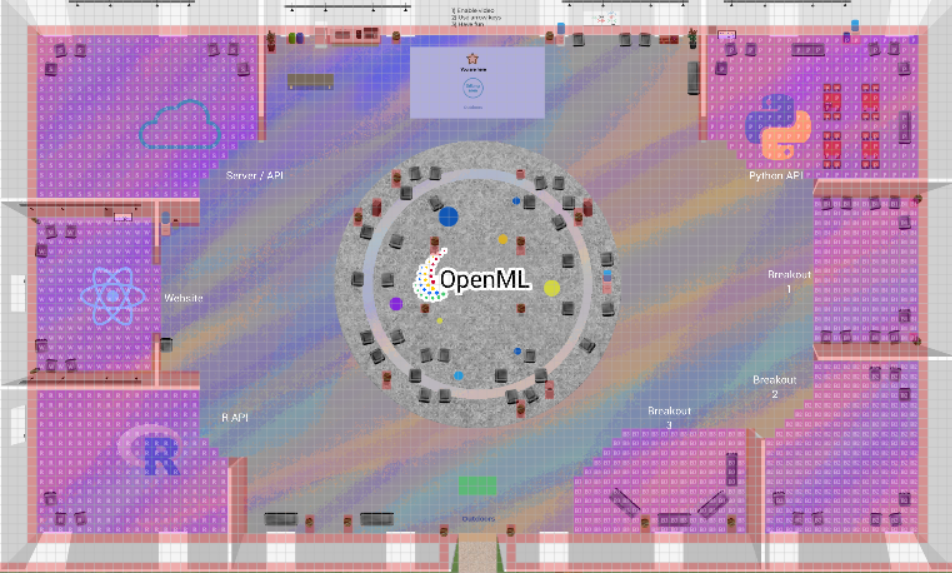

Twice a year the [OpenML](https://www.openml.org/) community organizes an OpenML workshop.
Next week we will kick off our fall workshop, which will be hosted virtually and open to everyone!
At the workshop we work on the development and maintenance of the OpenML platform(Website, APIs and extensions), 
but also encourage discussions on a broad range of topics, from using the platform to building the platform to building the community.
If you are already sure you want to join, please [register](https://docs.google.com/forms/d/e/1FAIpQLSedDOBZzuQP9dACFWiPqXcl1HvURB9h3SOdwPq45PB-87TPyg/viewform) and we will see you next week! :)

The workshops are the perfect time to get involved with the OpenML community.
We welcome first time contributors to the project. You con contribute also feedback, design, planning, content and cleaning data.
If you are looking to contribute to the software projects, we are there to help you get started on beginner issues.
Even better, the workshop coincides with [Hacktoberfest](https://hacktoberfest.digitalocean.com/), 
which means you can earn a shirt through your open source software contributions!
To get an even better idea of what happens at an OpenML workshop, read the [write-up of last year's fall workshop](how-to-link-to-blogpost?) 
and look at [the workshop agenda](https://docs.google.com/document/d/1-cjXSqjbce0Gq5zydkp-RNQQmxmcSW4WQ0fWTHUwU9E/edit#).

In this blog post we will go over the basics on how you can participate in the workshop.
This includes pointers to our code repositories, the platform we will use ([gather.town](https://gather.town/)), and participating in Hacktoberfest.

## Overview

**Where?** [openml at gather.town](https://gather.town/app/c5wA3zo8WPkg579u/openml)  
**When?**  26th through 30th of October 2020, 09.00-17.00 CET.  
**What?**  Discussions about OpenML, contributing to any OpenML project, or experimenting with OpenML.

Please [register](https://docs.google.com/forms/d/e/1FAIpQLSedDOBZzuQP9dACFWiPqXcl1HvURB9h3SOdwPq45PB-87TPyg/viewform) if you plan to join.
It is not required to attend the workshop in full.  
You are free to join only for a day or specific discussions.  
However, it is helpful to indicate which meetings you want to attend, so we know who to expect.  

The [workshop agenda](https://docs.google.com/document/d/1-cjXSqjbce0Gq5zydkp-RNQQmxmcSW4WQ0fWTHUwU9E/edit#) is public.
If you see a meeting which you would like to join, just add your name to the list.
Feel free to propose a new meeting by adding a proposal to the meeting list!

## Gather Town
This fall, we will host the OpenML Hackathon at our [gather.town space](https://gather.town/app/c5wA3zo8WPkg579u/openml).
Gather.town is a web-based platform that allows you to video conference with other people, but with a twist.
Rather than the conventional conference call, in gather.town you control an avatar that can navigate a virtual world.
You will automatically be connected to anyone that is within the vicinity of your avatar.
This means you can more organically join groups of people, or walk from one meeting room to the next.
Here is a preview of our OpenML map:

At a glance you see two types of areas: those marked with pink and those that are not marked.
Areas that are not marked (e.g. the main lobby) function exactly as described above.
However, whenever you are in a purple area you will automatically be connected to everyone else in the same purple area.
So whenever you are interested in joining people discussing the [new openml website](https://new.openml.org/), you just head over to that room!

## Hacktoberfest

[Hacktoberfest](https://hacktoberfest.digitalocean.com/) is a global event to support open source software.
If you contribute "enough" to open source projects, you will also be eligible to receive a free t-shirt and some other swag!
Our repositories welcome Hacktoberfest participation, so whenever you contribute to our repositories, you are working towards your Hacktoberfest goal.
The rules are simple:
 - Sign up at [Hacktoberfest](https://hacktoberfest.digitalocean.com/) with [Github](https://github.com/) credentials
 - Find an issue you can help with (more on that below)
 - Submit a pull request resolving the issue
 - To be eligible for the t-shirt and swag, you must open four pull requests (this is the "enough" part)
 

 
You can browse our repositories and identify issues which you would like to work on.
To make things easier, here are the list of openml repositories that are extra prepared for Hacktoberfest.
These repositories have core developers registered to attend the workshop, and have marked issues which are suitable for newcomers with the `hacktoberfest` label.

 - [openml.org](https://github.com/openml/openml.org) The front-end for the new OpenML!  (python, React.js, )
 - [OpenML](https://github.com/openml/OpenML) The back-end for OpenML.(php)
 - [openml-python](https://github.com/openml/openml-python) The Python API for interacting with the OpenML server. Please read [this welcome message](https://github.com/openml/openml-python/issues/953) to get started.(Python)
 - [docs](https://github.com/openml/docs) Documentation for OpenML.
 
Please be sure to check the respective repositories contribution guidelines, and don't be afraid to ask questions!
We were all new to open source once and are happy to help you get started too.
If you are just getting your feet wet with open source contribution, a great way to get started it to just try and use the packages/website.
If you see documentation which needs clarification, or perhaps even just a simple typo, we appreciate your help in fixing it!

## We hope to see you are our workshop!
If you have any questions about the workshop, feel free to leave a comment.
